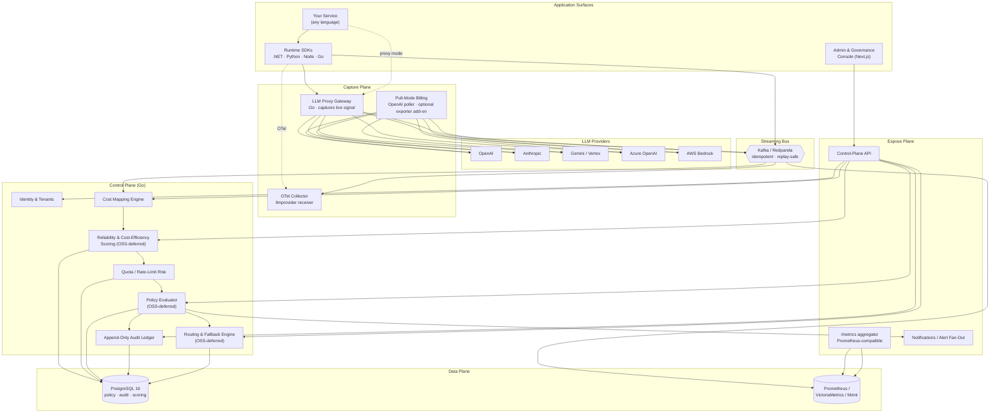

<!-- Copyright (c) 2026 Yasvanth Udayakumar. -->
<!-- SPDX-License-Identifier: Apache-2.0 -->
<!-- See LICENSE in the repository root for full terms. -->

<div align="center">

# OpenLLM Metrics

### Multi-Provider LLM Telemetry Control Plane · GenAI Observability · FinOps & Governance for AI APIs

_Normalize and govern every operational signal — usage, cost, latency, error, retry, and quota — across OpenAI, Anthropic Claude, Google Gemini / Vertex AI, Azure OpenAI, and AWS Bedrock. Open, OTel-native, multi-tenant, and built for teams running LLMs in production._

[](LICENSE)
[](#roadmap--build-phases)
[](#tech-stack)
[](#tech-stack)
[](#tech-stack)
[](#tech-stack)
[](#tech-stack)
[](#tech-stack)

[](#standards--compliance)
[](#how-openllm-metrics-collects-llm-signal-five-sources)
[](#standards--compliance)
[](#engineering-conventions)
[](#engineering-conventions)
[](#repository-layout)
[](#tech-stack)

</div>

---

**OpenLLM Metrics is an open-source, OpenTelemetry-native telemetry control plane for multi-provider LLM API operations.** It collects, normalizes, and exposes every operational signal that matters — latency, token usage, retries, errors, throttling, quota burn, and reconciled provider cost — across OpenAI, Anthropic Claude, Google Gemini / Vertex AI, Azure OpenAI, and AWS Bedrock; then feeds that signal into a declarative governance policy schema, an append-only audit ledger, dashboards, and open integration surfaces so platform teams can run LLM APIs the way they run every other production dependency.

**Built for**: SRE and platform engineering teams treating LLM APIs as production dependencies · AI platform teams running multi-provider workloads · FinOps teams that need per-team, per-model, per-tenant cost truth · security and governance owners who need an audit trail for every policy and routing decision · OSS adopters extending OpenTelemetry GenAI semantic conventions into LLM-native operational decisioning.

**Key capabilities**: provider-neutral metric schema (`llm_*`) extending OTel GenAI semconv · five-source telemetry capture (gateway · SDK · OTel · billing-API pollers · runtime reconciliation) · Prometheus-compatible `/metrics` aggregator · billing-API cost reconciliation (OpenAI poller in-repo; other providers via the optional exporter add-on) · quota-risk modeling · SLO framework with pre-built dashboard packs · declarative policy schema with append-only audit ledger · proxy-mode gateway (no-SDK-changes integration) · runtime SDKs for .NET, Python, Node.js, and Go · custom OpenTelemetry Collector receiver · multi-tenant by construction with `tenant` / `team` / `app` / `env` / `project` labels on every signal.

**Try it now** — three commands, no API keys (full walkthrough in [Quick Start](#quick-start)):

```bash
git clone https://github.com/xops-labs/openllm-metrics.git
cd openllm-metrics
docker compose --profile demo up -d   # then open http://localhost:3030
```

**Contents**: [Quick Start](#quick-start) · [Why Now](#the-problem) · [Five Signal Sources](#how-openllm-metrics-collects-llm-signal-five-sources) · [Architecture](#architecture-event-driven-microservices-for-multi-provider-llm-telemetry-at-scale) · [Features](#features--capabilities--38-modules-across-9-phases) · [Use Cases](#use-cases) · [Standards](#standards--compliance) · [Tech Stack](#tech-stack) · [Repository Layout](#repository-layout) · [Roadmap](#roadmap--build-phases) · [Integration Surfaces](#integration-surfaces--how-apps-and-pipelines-plug-in) · [Documentation Map](#documentation-map) · [FAQ](#frequently-asked-questions) · [Community](#community) · [Contributing](#contributing) · [Security](#security) · [License](#license)

---

<a id="the-problem"></a>

## Why LLM Observability Matters Now: The Multi-Provider Operations Gap

LLM APIs are now production dependencies — they break, drift, throttle, and burn money like every other production dependency. But the tooling hasn't caught up. Every provider reports latency, tokens, retries, errors, and cost in its own dialect. Every dashboard is a fork. Every SRE writes the same regex-soup to answer the same five questions:

> _Which model failed. How much did the failure cost. Which team is responsible. Is the budget about to blow. And what should we route to instead._

Generic APM tells you a request took 2.3 seconds. It does not tell you that **Claude Sonnet on Bedrock** in `us-west-2` for tenant `acme/prod` retried twice, used 4,180 cached input tokens at $0.30/M, and is now 87% of its hourly quota — and that switching to `gpt-4o-mini` on Azure for this prompt class would have cost 38% less with the same SLA. **OpenLLM Metrics is built to answer that class of question.**

Regulators and frameworks are catching up too — and they all converge on the same requirement: **continuous, auditable, model-aware operational telemetry**:

| Authority / Framework       | What it expects                                                                                                               | When                           |
| --------------------------- | ----------------------------------------------------------------------------------------------------------------------------- | ------------------------------ |
| **EU AI Act**               | Logging of operations sufficient for traceability of model behavior across the lifecycle                                      | Phased 2025–2027               |
| **NIST AI RMF 1.0**         | Measurable AI risk management with continuous monitoring and metrics                                                          | Available now                  |
| **ISO/IEC 42001**           | AI management system — performance evaluation, monitoring, incident reporting                                                 | Published 2023                 |
| **FinOps Foundation FOCUS** | Provider-neutral billing/usage spec for cloud and AI cost data                                                                | Active, AI extensions evolving |
| **SOC 2 / ISO 27001**       | Operational logging, change audit, access governance for production systems                                                   | Continuous                     |
| **GDPR / CPRA**             | Prompts and completions may contain personal data — separation of operational telemetry from content data is the safe default | In force                       |

**OpenLLM Metrics gives you the operational signal plane those frameworks assume you already have — without ever touching prompts or completions.**

---

## How OpenLLM Metrics Collects LLM Signal: Five Sources

OpenLLM Metrics normalizes operational telemetry from five complementary capture surfaces — each catches signal the others miss:

| #   | Source                                       | What it captures                                                                                              | When you use it                                                                 |
| --- | -------------------------------------------- | ------------------------------------------------------------------------------------------------------------- | ------------------------------------------------------------------------------- |
| 1   | **LLM Proxy Gateway**                        | Live latency, status, retries, token usage, response timings — at request boundary                            | When you cannot modify application code (third-party services, polyglot fleets) |
| 2   | **Runtime SDKs** (.NET · Python · Node · Go) | In-process spans + metrics under OTel GenAI semconv, with `tenant`/`team`/`app` baggage                       | When you want zero-overhead, in-language attribution                            |
| 3   | **Pull-Mode Billing Pollers**                | Authoritative usage and cost from provider billing / admin APIs                                               | For FinOps truth — runtime estimates ≠ billed amount                            |
| 4   | **OTel Collector Receiver**                  | OLM's normalized signal, ingested into your existing Collector pipeline via the custom `llmprovider` receiver | When you already centralize telemetry through a Collector                       |
| 5   | **Runtime ↔ Pull Reconciliation**            | Joins live gateway/SDK signal against polled billing facts                                                    | For drift detection, leak detection, cost-attribution audits                    |

All five sources collapse into one canonical schema before crossing a service boundary — so dashboards, scoring, policy, audit, and downstream exports all read from the same shape.

> **What ships where:** sources 1 and 2 cover all five providers today — the gateway, SDKs, and quota-risk worker parse usage and rate-limit signal for OpenAI, Anthropic, Gemini / Vertex, Azure OpenAI, and Bedrock — and source 4 relays that same provider-neutral normalized signal from the bus into your existing Collector pipeline. For source 3, the in-repo billing poller ships for OpenAI; pull-mode billing for the other providers runs through the optional `llm-usage-exporter` add-on (bring your own image via `LLM_USAGE_EXPORTER_IMAGE`, then `docker compose --profile exporter up -d`), with in-repo pollers on the roadmap.

---

## Architecture: Event-Driven Microservices for Multi-Provider LLM Telemetry at Scale



**Principles**

- **Schema-stable signal.** Every capture surface emits the canonical normalized telemetry shape before crossing a service boundary. Dashboards, scoring, policy, and audit all read from one schema.
- **Multi-tenant by construction.** Every metric, every audit row, every policy decision carries `tenant`, `team`, `app`, `env`, and `project` attribution — tenant context enters at the gateway via `X-OLM-*` headers, and control-plane services filter by tenant. Gateway-level authentication (per-tenant API keys / JWT) is on the roadmap.
- **OTel-native, not OTel-adjacent.** Extends OpenTelemetry GenAI semantic conventions; `llm_*` names are additive, never replacing or shadowing OTel.
- **Privacy-first by construction.** Prompts and completions are **never** collected, logged, or stored. Only operational signal crosses any wire we control.
- **Workers are stateless and idempotent.** State lives in Postgres / TSDB / queue. Replay-safe consumers from day one.
- **Provider adapters, not provider forks.** Adding a new provider is an adapter, not a fork; the rest of the platform doesn't know which vendor emitted a signal.

**Architecture deep dive.** This diagram is the conceptual view. For the full
set — system context, component/container view, the telemetry data-flow
pipeline, request sequence diagrams, deployment topology, and the extension
boundary — start at [docs/architecture/overview.md](docs/architecture/overview.md)
(index: [docs/architecture/](docs/architecture/README.md)).

---

## Features & Capabilities — 38 Modules Across 9 Phases

The platform is decomposed into 38 implementation-ordered features across 9 phases (IDs `F001`–`F039`; `F028` has no open-source surface and is not tracked here). The roadmap below separates implemented modules from deferred interfaces and planned work.

### Phase 0 — Foundation

| ID   | Capability                                        | Status |
| ---- | ------------------------------------------------- | ------ |
| F001 | Repository Foundation and CI/CD Skeleton          | active |
| F002 | Streaming Bus and Schema Registry Baseline        | active |
| F003 | Postgres Baseline and Migration Tooling           | active |
| F004 | TSDB Baseline and Scrape Pipeline                 | active |
| F005 | Identity and Tenant Model                         | active |
| F006 | Observability Baseline (OTel + GenAI Semconv)     | active |
| F007 | Security Baseline (Secrets, Scanning, CODEOWNERS) | active |

### Phase 1 — OSS Metrics Exporter

| ID   | Capability                                          | Status |
| ---- | --------------------------------------------------- | ------ |
| F008 | Common Operational Telemetry Schema                 | active |
| F009 | OpenAI Usage and Cost Poller                        | active |
| F010 | Prometheus `/metrics` Aggregator Service            | active |
| F011 | Distribution Baseline (Docker, Config, OTel Sample) | active |
| F012 | FinOps Dashboard and Alert Rules Pack               | active |

### Phase 2 — Multi-Provider Normalization

| ID   | Capability                               | Status  |
| ---- | ---------------------------------------- | ------- |
| F013 | Anthropic Claude Usage Poller            | planned |
| F014 | Google Gemini and Vertex AI Usage Poller | planned |
| F015 | Azure OpenAI Usage Poller                | planned |
| F016 | AWS Bedrock Usage Poller                 | planned |
| F017 | Provider-Neutral Cost Mapping Engine     | active  |

> The in-repo billing pollers for Anthropic, Gemini / Vertex, Azure OpenAI, and Bedrock (F013–F016) are planned. Today, runtime telemetry for all five providers ships via the gateway and SDKs, and pull-mode billing reconciliation for these providers is available through the optional `llm-usage-exporter` add-on (bring your own image via `LLM_USAGE_EXPORTER_IMAGE`, then `docker compose --profile exporter up -d`).

### Phase 3 — Runtime SDK Wrappers and Proxy Mode

| ID   | Capability                                      | Status |
| ---- | ----------------------------------------------- | ------ |
| F018 | LLM Proxy Gateway Service (Proxy Mode)          | active |
| F019 | Runtime SDK Contract and .NET Instrumentation   | active |
| F020 | Python Runtime Instrumentation SDK              | active |
| F021 | Node.js Runtime Instrumentation SDK             | active |
| F022 | Go Runtime Instrumentation SDK                  | active |
| F023 | Pull-Mode / Proxy-Mode Reconciliation Framework | active |

### Phase 4 — Reliability and Cost Scoring Engine

| ID   | Capability                                        | Status     |
| ---- | ------------------------------------------------- | ---------- |
| F024 | Reliability Scoring Engine **(OSS-deferred)**     | scaffolded |
| F025 | Cost-Efficiency Scoring Engine **(OSS-deferred)** | scaffolded |
| F026 | Quota and Rate-Limit Risk Model                   | active     |
| F027 | SLO Framework and Dashboard Pack                  | active     |

### Phase 5 — Policy and Governance Engine

| ID   | Capability                                            | Status     |
| ---- | ----------------------------------------------------- | ---------- |
| F029 | Declarative Policy Schema, Storage, Versioning        | active     |
| F030 | Policy and Budget Evaluator Worker **(OSS-deferred)** | scaffolded |
| F031 | Append-Only Audit Ledger                              | active     |
| F032 | Admin and Governance Console                          | active     |
| F033 | Notification and Alerting Fan-Out                     | active     |

### Phase 6 — Dynamic Routing and Fallback Engine

| ID   | Capability                                          | Status     |
| ---- | --------------------------------------------------- | ---------- |
| F034 | Routing Decision Engine **(OSS-deferred)**          | scaffolded |
| F035 | Bounded Fallback Engine **(OSS-deferred)**          | scaffolded |
| F036 | Routing-Decision Explainability and Decision Ledger | active     |

### Phase 7 — OTel-Native Collector Component

| ID   | Capability                                   | Status |
| ---- | -------------------------------------------- | ------ |
| F037 | Custom OTel Collector `llmprovider` Receiver | active |

### Phase 8 — Native Console Analytics & Exports

| ID   | Capability                                                                 | Status |
| ---- | -------------------------------------------------------------------------- | ------ |
| F038 | Native Console Analytics — Metrics Explorer, Saved Views & Dashboards      | active |
| F039 | Bundled Data Exports (OTel GenAI, JSONL archive, Datadog / Grafana bridge) | active |

---

## Use Cases

| Role                          | What OpenLLM Metrics does for you                                                                                                                                                                                                                                                             |
| ----------------------------- | --------------------------------------------------------------------------------------------------------------------------------------------------------------------------------------------------------------------------------------------------------------------------------------------- |
| **SRE / Platform Engineer**   | Multi-provider latency, retry, error, throttling, and quota-burn metrics on Prometheus-compatible endpoints. Pre-built SLO dashboards with multi-window burn-rate alerts per model and per tenant.                                                                                            |
| **AI Platform / ML Platform** | Per-app, per-model, per-route operational signal across every provider in one schema. Reliability and cost signals across `(provider, model, route)` tuples so you can stop arguing about which model is "flaky" and start measuring it. |
| **FinOps / Cloud Economics**  | Billing-API-reconciled cost truth, not runtime estimates. Per-team / per-tenant / per-app cost breakdown on day one. Provider-neutral cost mapping aligned to FinOps FOCUS.                                                                                                                   |
| **Security / Governance**     | Declarative policy schema with append-only audit ledger. Every policy mutation, every routing override, every exception — logged, hash-chained, exportable to your SIEM. No prompts or completions in the audit trail by design.                                                              |
| **Application Engineer**      | Drop-in SDKs for .NET, Python, Node, and Go that emit OTel GenAI semconv spans with full `tenant`/`team`/`app` baggage — or proxy-mode gateway if you cannot modify the code.                                                                                                                 |
| **Compliance / Risk**         | Hash-chained, append-only operational logging with no prompt or completion content — evidence you can bring to your own AI-governance and audit reviews.                                                                                                                                      |
| **OSS Adopter / Integrator**  | Vendor-neutral exporters, OTel Collector receiver, dashboards, alert packs, and adapter scaffolding under Apache-2.0 — no lock-in, no per-provider fork.                                                                                                                                      |

---

## Standards & Compliance

OpenLLM Metrics builds on the open telemetry and FinOps standards that matter for LLM operations:

### Telemetry & Metric Standards

| Standard                                     | What we do with it                                                                                          |
| -------------------------------------------- | ----------------------------------------------------------------------------------------------------------- |
| **OpenTelemetry GenAI Semantic Conventions** | We extend, never replace. Project-specific names use the `llm_*` prefix and are additive to OTel semconv    |
| **Prometheus Exposition Format**             | The `/metrics` aggregator is fully Prometheus-compatible (and works with VictoriaMetrics and Grafana Mimir) |
| **W3C Trace Context**                        | `traceparent` propagation across gateway, SDKs, pollers, and the control plane                              |
| **OpenMetrics**                              | Cumulative counters and histograms emitted per the OpenMetrics spec                                         |

### FinOps & Cost Standards

| Standard                          | What we do with it                                                                                                   |
| --------------------------------- | -------------------------------------------------------------------------------------------------------------------- |
| **FinOps Foundation FOCUS**       | Provider-neutral cost-mapping engine produces FOCUS-style columns where AI extensions exist                          |
| **Provider Usage / Billing APIs** | In-repo poller reconciles against the OpenAI billing API; the optional exporter add-on extends pull-mode to the rest |

### Governance & privacy posture

OpenLLM Metrics is not certified against any compliance framework and ships
no compliance tooling. What it does provide are useful **evidence inputs**
for teams running their own AI-governance or audit programs: continuous
operational telemetry, an append-only hash-chained audit ledger, and a
design that never collects, logs, or stores prompts or completions — so the
telemetry path stays free of personal-data spillover by construction.

### Standards Consumed & Emitted

- **OpenTelemetry Protocol (OTLP)** — both inbound (Collector receiver) and outbound (exporters)
- **Prometheus exposition** — `/metrics` endpoint
- **OIDC** — scaffold in the admin console (bring your own IdP); gateway-level authentication is on the roadmap
- **JSON Schema 2020-12** — canonical contracts for normalized telemetry, policy schema, and SDK payloads

---

<a id="tech-stack"></a>

## Tech Stack: Go, TypeScript, .NET, PostgreSQL, Prometheus, Kafka, OpenTelemetry

| Layer                          | Technology                                                                   | Why                                                                                                            |
| ------------------------------ | ---------------------------------------------------------------------------- | -------------------------------------------------------------------------------------------------------------- |
| **Hot path / Gateway**         | Go 1.25+                                                                     | Single static binaries, fast startup, predictable GC, low overhead in the request path                         |
| **Pollers & Workers**          | Go 1.25+                                                                     | Same; long-running, idempotent, easily distributed                                                             |
| **Control Plane API**          | Go 1.25+ (policy · audit · decision · analytics · metrics-endpoint services) | One toolchain across gateway, workers, and control plane; single static binaries; JSON-Schema-backed contracts |
| **Admin & Governance Console** | Next.js 15 · React 19 · TypeScript 5 · Tailwind · react-jsonschema-form      | RSC-first; accessible by default; admin-only (no consumer surface)                                             |
| **Persistence**                | PostgreSQL 16                                                                | Policy, audit ledger, scoring records, historical aggregates; row-level security on control-plane tables       |
| **Time-Series**                | Prometheus-compatible TSDB (Prometheus / VictoriaMetrics / Grafana Mimir)    | Operational metrics with high cardinality (`tenant` × `team` × `model`)                                        |
| **Streaming Bus**              | Kafka or Redpanda                                                            | Idempotent consumers, replay safety, decoupled pollers / scoring / policy                                      |
| **Runtime SDKs**               | .NET 8 · Python 3.10+ · Node.js 20+ · Go 1.25+                               | First-class OTel GenAI semconv emission in every major server language                                         |
| **Observability**              | OpenTelemetry · W3C `traceparent` · structured JSON logs                     | Cross-service tracing from SDK through gateway, pollers, scoring, policy                                       |
| **Secrets**                    | Your own secret manager + environment variables                              | The gateway never stores provider keys — caller `Authorization` headers pass through untouched and unlogged    |
| **Identity**                   | Dev-login + OIDC scaffold in the admin console (bring your own IdP)          | Gateway-level authn (per-tenant keys / JWT) is on the roadmap                                                  |
| **Distribution**               | Docker images · OTel Collector samples · Helm (roadmap)                      | Run anywhere — single-team to multi-tenant deployments                                                                |

---

## Repository Layout

```
openllm-metrics/
├── apps/
│   ├── gateway/                        # LLM proxy gateway — live signal capture (Go)
│   ├── api/
│   │   ├── analytics-service/          # Native console analytics — saved views & dashboards API
│   │   ├── policy-service/             # Declarative policy CRUD + versioning
│   │   ├── audit-service/              # Append-only audit ledger API
│   │   ├── decision-service/           # Routing-decision ledger & explainability API
│   │   └── metrics-endpoint/           # Prometheus-compatible /metrics aggregator (Go)
│   ├── worker/
│   │   ├── usage-poller/openai/        # In-repo billing-API poller (OpenAI)
│   │   ├── cost-mapper/                # Provider-neutral cost mapping engine
│   │   ├── reconciler/                 # Runtime ↔ pull-mode reconciliation
│   │   ├── quota-risk/                 # Quota / rate-limit risk worker
│   │   ├── notifier/                   # Notification & alert fan-out
│   │   ├── label-translator/           # Optional exporter add-on — label mapping
│   │   └── focus-ingester/             # Optional exporter add-on — FOCUS cost ingestion
│   └── web/
│       └── admin-console/              # Admin & governance console (Next.js)
├── packages/                           # bus-client · contracts · dashboards · extensions
│                                       #   · sdk-dotnet · sdk-go · sdk-node · sdk-python · telemetry
├── platform/
│   ├── bus/                            # Streaming-bus deployment manifests
│   ├── db/                             # Postgres schemas, migrations, seeds
│   ├── deployment/                     # docker-compose / k8s manifests
│   ├── observability/                  # Grafana dashboards, alert packs, Collector configs
│   ├── otel-collector/                 # Custom OTel Collector llmprovider receiver
│   └── tsdb/                           # Prometheus / VictoriaMetrics / Mimir configs
├── cmd/                                # olm-audit CLI
├── examples/                           # demo-generator · proxy-demo
├── tests/                              # Contract · dashboard · provider-adapter suites
├── docs/                               # Architecture notes · quickstart · product guides
├── tools/                              # Bootstrap, lint, test, release scripts
├── .github/                            # CODEOWNERS · CI workflows · issue & PR templates
├── CONTRIBUTING.md                     # Contribution guide and commit conventions
└── LICENSE                             # Apache-2.0
```

---

<a id="roadmap--build-phases"></a>

## Roadmap & Build Phases

The platform ships in nine tiered phases. Each phase is a coherent, usable product slice — the OSS exporter is independently useful even if scoring and policy haven't landed.

| Phase | Theme                        | Capabilities                                                                            | Demo target                                            |
| ----- | ---------------------------- | --------------------------------------------------------------------------------------- | ------------------------------------------------------ |
| **0** | **Foundation**               | Repo · CI/CD · identity · TSDB · streaming bus · Postgres · OTel baseline · security    | Local stack boots; tenants exist; signal flows         |
| **1** | **OSS Exporter**             | Common schema · OpenAI poller · `/metrics` aggregator · Docker · FinOps dashboards      | Single team → unified `/metrics` and Grafana board     |
| **2** | **Multi-Provider Parity**    | Cost-mapping (shipped) · Anthropic / Gemini / Azure / Bedrock billing pollers (planned) | One schema across all five providers                   |
| **3** | **SDKs & Proxy Mode**        | Gateway · .NET / Python / Node / Go SDKs · pull/proxy reconciliation                    | Drop-in integration in any language                    |
| **4** | **Scoring & SLO**            | Reliability · cost-efficiency · quota-risk · SLO pack                                   | Reliability scores per `(provider, model)` tuple, live |
| **5** | **Policy & Governance**      | Declarative policy · evaluator · audit ledger · admin console · notifications           | Budget caps and allowed-model lists, audit-backed      |
| **6** | **Routing & Fallback**       | Routing engine · bounded fallback · decision explainability                             | Cost-aware, reliability-aware routing decisions        |
| **7** | **OTel Native**              | Custom `llmprovider` OTel Collector receiver                                            | Drop into any existing OTel pipeline                   |
| **8** | **Native Console Analytics** | Guided metrics explorer · saved views & dashboards · bundled exports out                | Ad-hoc questions answered in the console, no Grafana   |

Current state: phases 0, 1, 3, and 8 substantially active; phase 2 ships the cost-mapping engine (runtime parity already covers all five providers); phases 4–7 are partially active through schemas, APIs, ledgers, and safe defaults.

### What's next — roadmap

| Item                                    | What it adds                                                                                       | Interim path today                                                                                                                        |
| --------------------------------------- | -------------------------------------------------------------------------------------------------- | ----------------------------------------------------------------------------------------------------------------------------------------- |
| **Gateway authentication**              | Per-tenant API keys / JWT enforced at the proxy boundary                                           | Run the gateway inside a trusted network or behind your own authenticating proxy                                                          |
| **Full-stack Helm chart**               | One-command Kubernetes install of all fourteen services                                            | docker-compose runs the full stack; the Phase-1 chart covers poller + metrics-endpoint                                                    |
| **In-repo billing pollers (F013–F016)** | Native Anthropic / Gemini · Vertex / Azure OpenAI / Bedrock billing reconciliation                 | Pull-mode billing via the optional bring-your-own `llm-usage-exporter` add-on (set `LLM_USAGE_EXPORTER_IMAGE`, then `--profile exporter`) |
| **Alertmanager → bus bridge**           | Prometheus alerts fan out through the notifier (channels, routing rules, delivery ledger) natively | Point Alertmanager at your own receivers; the notifier HTTP API is the stable contract                                                    |

---

## Canonical Normalized Telemetry Shape

Every capture surface — gateway, SDK, poller, OTel receiver — normalizes to one event shape before crossing a service boundary. This is what flows through cost mapping, scoring, policy, audit, and dashboards.

```jsonc
{
  "eventId": "uuid-v7",
  "tenantId": "uuid",
  "team": "platform-search",
  "app": "rag-answer-svc",
  "env": "prod",
  "project": "acme-search",
  "provider": "anthropic",
  "model": "claude-sonnet-4-6",
  "route": "chat.messages",
  "region": "us-west-2",
  "source": "gateway", // gateway | sdk | poller | otel
  "requestId": "ulid",
  "latencyMs": 1840,
  "ttftMs": 312,
  "tokensInput": 4180,
  "tokensInputCached": 3900,
  "tokensOutput": 612,
  "retries": 0,
  "status": "ok", // ok | error | throttled | cancelled
  "errorCode": null,
  "quotaUsedRatio": 0.41,
  "estimatedCostUsd": 0.0187,
  "reconciledCostUsd": null, // filled by poller-side reconciliation
  "occurredAt": "2026-05-12T08:00:00Z",
}
```

A corresponding family of Prometheus-compatible metrics:

```text
llm_request_duration_seconds{tenant,team,app,env,project,provider,model,route,status}
llm_tokens_total{tenant,team,app,env,project,provider,model,kind="input|input_cached|output"}
llm_cost_usd_total{tenant,team,app,env,project,provider,model,source="runtime|reconciled"}
llm_errors_total{tenant,team,app,env,project,provider,model,error_code}
llm_retries_total{tenant,team,app,env,project,provider,model}
llm_quota_used_ratio{tenant,team,app,env,project,provider,model,region}
```

All names extend (do not replace) OpenTelemetry GenAI semantic conventions.

---

## Integration Surfaces — How Apps and Pipelines Plug In

There are four supported integration paths. Pick whichever fits your fleet — or mix.

| Surface                                     | Code change required               | Latency overhead      | Best for                                                      |
| ------------------------------------------- | ---------------------------------- | --------------------- | ------------------------------------------------------------- |
| **Proxy-Mode Gateway**                      | Change base URL only               | low                   | Polyglot fleets, third-party services, "can't touch the code" |
| **Runtime SDK** (.NET / Python / Node / Go) | One import, one init               | very low (in-process) | Native integration, full baggage propagation                  |
| **OTel Collector Receiver** (`llmprovider`) | Add receiver to existing Collector | none in app path      | Teams already centralizing via OTel Collector                 |
| **Pull-Mode Only (Usage Pollers)**          | None                               | none                  | FinOps-only deployments, cost dashboards                      |

The Pull/Proxy Reconciliation Framework joins live signal (gateway / SDK) with polled billing facts so you can run any combination and still get consistent dashboards. The in-repo billing poller covers OpenAI today; pull-mode coverage for the other providers comes via the optional `llm-usage-exporter` add-on.

---

## Documentation Map

| Document                                                                 | Purpose                                                                                              |
| ------------------------------------------------------------------------ | ---------------------------------------------------------------------------------------------------- |
| **[docs/quickstart.md](docs/quickstart.md)**                             | Step-by-step local run — Docker stack, demo data, dev login, ports, troubleshooting                  |
| **[docs/README.md](docs/README.md)**                                     | Documentation index for everything under `docs/`                                                     |
| **[docs/architecture/](docs/architecture/README.md)**                    | Architecture deep dives — overview, components, data flow, sequences, deployment, per-provider notes |
| **[docs/product/slo-framework.md](docs/product/slo-framework.md)**       | SLO framework — SLIs, objectives, burn-rate alerting                                                 |
| **[docs/product/dashboards.md](docs/product/dashboards.md)**             | The shipped Grafana dashboard pack and how to extend it                                              |
| **[docs/product/config-reference.md](docs/product/config-reference.md)** | Configuration reference for the OpenAI poller and `/metrics` aggregator                              |
| **[platform/runbooks/](platform/runbooks/)**                             | Operational runbooks — cost spike, error rate, stale exporter                                        |
| **[CONTRIBUTING.md](CONTRIBUTING.md)**                                   | How to contribute; commit conventions and review expectations                                       |
| **[SECURITY.md](SECURITY.md)**                                           | Vulnerability disclosure policy                                                                      |
| **[CODE_OF_CONDUCT.md](CODE_OF_CONDUCT.md)**                             | Contributor Covenant                                                                                 |

---

## Quick Start

> Full step-by-step guide: **[docs/quickstart.md](docs/quickstart.md)**

All you need to **run** the stack is Docker — every service, plus PostgreSQL,
Redpanda, Prometheus, and Grafana, runs via Docker Compose, and the stack
boots keyless (every compose variable has a sane default).

```bash
# Clone
git clone https://github.com/xops-labs/openllm-metrics.git
cd openllm-metrics

# Optional: copy the env template. The stack boots without a .env —
# you only need one to set real provider keys (e.g. OPENAI_ADMIN_API_KEY
# for live OpenAI billing pull).
cp .env.example .env

# Recommended first run: core stack + demo traffic generator — gateway
# · all services · admin console · Postgres · Redpanda · Prometheus
# · Grafana, plus synthetic multi-provider telemetry (no API keys needed;
# every analytics screen and dashboard lights up within a minute).
# DB migrations and the demo seed run automatically as one-shot services.
docker compose --profile demo up -d
```

> **First build takes a while.** The first `up` builds ~16 service images
> from source (Go multi-stage + Next.js builds) — expect 10–20 minutes on a
> typical laptop. Later runs reuse the build cache and start in seconds.

Once the stack is up, open <http://localhost:3030> — the admin console uses a
**passwordless dev login**: sign in with any email (the default dev actor is
`admin@acme.dev`; override with `OLM_DEV_USER`) and you land on the seeded
demo tenant. Grafana signs in with `admin` / `devpassword`.

| Interface                                     | URL                                      |
| --------------------------------------------- | ---------------------------------------- |
| Admin console (native analytics)              | <http://localhost:3030/analytics>        |
| Admin console (exports settings)              | <http://localhost:3030/settings/exports> |
| Grafana dashboards (bundled; optional to use) | <http://localhost:3000>                  |
| Prometheus                                    | <http://localhost:9090>                  |
| Metrics endpoint                              | <http://localhost:9092/metrics>          |
| LLM Proxy Gateway                             | <http://localhost:8085>                  |

Point an LLM SDK at the local gateway (`http://localhost:8085/v1`) and watch
unified `llm_*` metrics appear in the native analytics screens and in Prometheus.

> Telemetry is **runtime-first**: the in-repo Go gateway + SDKs capture provider
> usage/cost/latency with no external exporter. Pull-mode billing reconciliation
> is an **optional add-on** — bring your own exporter image and set
> `LLM_USAGE_EXPORTER_IMAGE` (the pinned upstream default may not be publicly
> pullable):
>
> ```bash
> LLM_USAGE_EXPORTER_IMAGE=ghcr.io/your-org/llm-usage-exporter:v0.5.0 \
>   docker compose --profile exporter up -d
> ```

### Local development (contributors)

Building or hacking on the services outside Docker also needs **Go 1.25+**
and **Node.js 20+ / pnpm 9+**:

```bash
# One-time: enable pnpm via Corepack so `pnpm` is on PATH directly.
# (Root scripts like `pnpm test` shell out to bare `pnpm`, so this step
# is required even if you usually invoke `corepack pnpm`.)
corepack enable pnpm

# Bootstrap — checks prerequisites (go · node · pnpm · docker), runs
# `pnpm install`, and installs golangci-lint. Dev-only: not needed for
# `docker compose up`, and it does not run DB migrations (those run
# automatically inside compose).
./tools/scripts/bootstrap.sh
```

### Requirements

- **Docker 24+** — the only requirement for running the full local stack
  (PostgreSQL 16, Redpanda, Prometheus, Grafana, and all services are bundled)
- **Go 1.25+** — local development only: gateway, workers, metrics endpoint, SDKs
- **Node.js 20+ / pnpm 9+** — local development only: admin console (install pnpm via `corepack enable pnpm`)

---

## Engineering Conventions

- **Schema-stable contracts.** Every cross-service message conforms to a versioned contract; breaking changes require a new version, not a mutation.
- **Tenant attribution everywhere.** `tenant_id` on every row, every event, every queue partition, every storage prefix. Tenant context enters at the gateway via `X-OLM-*` headers, and control-plane services filter by tenant; gateway-level authentication (per-tenant API keys / JWT) is on the roadmap.
- **Stateless workers.** Workers carry no state across jobs; checkpoints live in DB / TSDB / queue.
- **Privacy-first telemetry.** Prompts and completions are never collected, logged, or stored. The gateway never stores provider API keys — caller `Authorization` headers pass through untouched and are never logged.
- **Adapters, not forks.** New providers are adapters under a stable interface; the rest of the platform stays provider-agnostic.
- **OTel-extend, never OTel-replace.** Project-specific metric names use the `llm_*` prefix and are additive to OpenTelemetry GenAI semantic conventions.
- **Findings and decisions are immutable facts.** Policy decisions, routing overrides, and exceptions are append-only with hash-chained audit; supersession over mutation.
- **Audit on every governance mutation.** Policy CRUD, routing override, exception creation/approval — all logged with actor, tenant, before/after state.

---

## Frequently Asked Questions

### What is OpenLLM Metrics, in one sentence?

A vendor-neutral, OpenTelemetry-native telemetry control plane that normalizes operational signal — usage, cost, latency, errors, retries, quotas — across OpenAI, Anthropic Claude, Google Gemini / Vertex AI, Azure OpenAI, and AWS Bedrock, then feeds that signal into scoring, governance, and decisioning for platform teams running LLM APIs in production.

### How is this different from APM tools or LangSmith / Helicone / Langfuse?

Generic APM (Datadog, New Relic, Honeycomb) gives you HTTP-level metrics — request count, latency, error rate. It does not know what a token is, does not reconcile against the provider billing API, does not normalize across vendors, and does not feed scoring or governance. LLM-observability tools tend to be prompt/completion-centric (trace what the model said) and cloud-only. OpenLLM Metrics is **operations-centric** (treat LLM APIs as production dependencies), **provider-neutral** by construction, **OSS** under Apache-2.0, **OTel-native** (extends GenAI semconv rather than parallel naming), **multi-tenant from day one**, and explicitly **never** touches prompts or completions. It is complementary to prompt-tracing tools, not a replacement.

### Which providers are supported?

All five providers — OpenAI, Anthropic Claude, Google Gemini / Vertex AI, Azure OpenAI, and AWS Bedrock — are supported today on the **runtime path**: the proxy gateway parses usage for all five, the runtime SDKs emit normalized signal for all five, and the quota-risk worker understands each provider's rate-limit headers. On the **pull-mode (billing reconciliation) path**, the in-repo poller ships for OpenAI; billing reconciliation for the other four is available via the optional `llm-usage-exporter` add-on (bring your own image via `LLM_USAGE_EXPORTER_IMAGE`, then `docker compose --profile exporter up -d`), with in-repo pollers (F013–F016) on the roadmap. The adapter interface is stable — new providers are added without forking the rest of the platform.

### How are prompts and completions handled?

They are **not** handled. The platform collects only operational telemetry — counts, sizes, timings, error codes, cost, quota — and never carries prompt or completion content across any wire we control. This is a design invariant, not a configuration option. It is also why OpenLLM Metrics is safe to run in environments under GDPR, CPRA, and EU AI Act constraints without prompt-content data-handling reviews.

### What is the integration model?

Four supported paths: (1) **Proxy-Mode Gateway** — change the base URL only; (2) **Runtime SDKs** for .NET, Python, Node.js, and Go — one import + one init; (3) **OTel Collector Receiver** — drop the custom `llmprovider` receiver into your existing Collector pipeline; (4) **Pull-Mode Only** via billing-API polling for FinOps-only deployments — the in-repo poller covers OpenAI, and the optional `llm-usage-exporter` add-on covers the other providers. The Pull/Proxy Reconciliation Framework joins live and polled signal into a single consistent view.

### How does cost reconciliation work?

Runtime captures (gateway + SDK) emit an **estimated** cost based on token counts and the active price catalog. The pull-mode path then brings in authoritative usage and cost from provider billing APIs — via the in-repo OpenAI poller today, and via the optional `llm-usage-exporter` add-on for the other providers. The Pull/Proxy Reconciliation Framework joins both, exposing `runtime` and `reconciled` cost as separate series so you can spot drift, leaks, and unbilled traffic.

### Is OpenLLM Metrics actually open source?

Yes — Apache-2.0. The open-source repo includes the gateway, SDKs, normalized metric schema, pollers, `/metrics` aggregator, audit ledger, dashboards, alert packs, OTel Collector receiver, policy schema, and safe default implementations for pluggable decision interfaces.

### What does the multi-tenant model look like?

Every metric, event, audit row, and policy decision carries `tenant`, `team`, `app`, `env`, and `project` attribution — tenant context enters at the gateway via `X-OLM-*` headers, and control-plane services filter every query by tenant. The gateway holds no provider keys (callers' `Authorization` headers pass through untouched), and queues are partitioned by tenant where ordering matters. Gateway-level authentication (per-tenant API keys / JWT) is on the roadmap; today the gateway trusts the inbound tenant headers it receives, so run it inside a trusted network or behind your own authenticating proxy.

### Which dashboards and alerts ship out of the box?

The Phase 1 FinOps Dashboard and Alert Rules Pack ships a ready-to-import Grafana dashboard covering spend by provider / model / team / app, token consumption, error rate by provider, cost per successful request, and budget burn — plus Prometheus alert rules for cost spikes, error rates, and stale exporters. The Phase 4 SLO framework adds availability, latency, and cost SLO dashboards with multi-window burn-rate panels.

### Where does scoring sit in the control loop?

Reliability scoring (F024) and cost-efficiency scoring (F025) are modeled as pluggable interfaces over the normalized telemetry stream. The open-source repo publishes the schemas, API surfaces, ledgers, and safe defaults; production scoring logic is intentionally not implemented here.

### Can I extend it to a provider that isn't on the list?

Yes — that's the design. Adding a provider is an adapter implementing the stable interface (auth, usage-API pagination, normalization to the canonical event shape). Provider-specific code stays under the adapter; the rest of the platform doesn't know which vendor emitted a signal.

### How does this fit with OpenTelemetry?

OpenLLM Metrics **extends** OpenTelemetry GenAI semantic conventions rather than competing with them. Project-specific names use the `llm_*` prefix and are additive. The SDKs emit OTel spans + metrics under the official semconv; the custom `llmprovider` OTel Collector receiver lets teams that already centralize via OTel ingest the same normalized signal without changing application code.

---

## Community

We're early — and that's the best time to shape the project.

- **GitHub Issues** — bug reports, feature requests, and [good first issues](https://github.com/xops-labs/openllm-metrics/labels/good%20first%20issue)
- **GitHub Discussions** — design questions, RFCs, show-and-tell _(enable Discussions on the repo to activate)_

If you build production LLM apps, run platform infra, do SRE on AI workloads, or care about LLM FinOps — **come talk to us**. New provider adapters, dashboard packs, alerting rules, and docs improvements are the fastest paths to a first contribution.

---

## Contributing

We read every PR and most issues within 48 hours.

1. Read [CONTRIBUTING.md](CONTRIBUTING.md) — branching, conventional commits, the PR checklist, and CODEOWNERS-protected paths.
2. Pick a [good first issue](https://github.com/xops-labs/openllm-metrics/labels/good%20first%20issue) or open a Discussion if you want to scope something larger.
3. By contributing you agree to license your work under [Apache-2.0](LICENSE) and abide by the [Code of Conduct](CODE_OF_CONDUCT.md).

Adapters, exporters, dashboards, normalizers, the admin console, the OTel Collector receiver, and the docs are all fair game. For new scoring, routing, fallback, or policy-evaluation semantics, open an issue first so the shape can be reviewed before implementation.

---

## Security

If you find a vulnerability, **please do not file a public issue**. Email <yasvanth@live.in> and follow the disclosure process in [SECURITY.md](SECURITY.md). We acknowledge within 2 business days.

Operational guardrails baked into the design:

- Prompts and completions are never collected, logged, or stored.
- The gateway never stores provider API keys — caller `Authorization` headers pass through untouched and are never logged or traced.
- Every signal carries `tenant` / `team` / `app` / `env` / `project` attribution (via `X-OLM-*` headers at the gateway), and control-plane services filter by tenant; gateway-level authentication (per-tenant API keys / JWT) is on the roadmap.
- Audit records are append-only with hash-chaining.
- Sensitive code paths require explicit maintainer review via CODEOWNERS.

---

## Topics This Repository Covers

`llm-observability` · `llm-telemetry` · `llm-metrics` · `genai-observability` · `genai-operations` · `genai-finops` · `llm-finops` · `ai-platform` · `ai-sre` · `multi-provider-llm` · `provider-neutral` · `vendor-neutral` · `opentelemetry` · `opentelemetry-genai` · `otel-genai-semconv` · `prometheus` · `prometheus-exporter` · `victoria-metrics` · `grafana-mimir` · `grafana-dashboards` · `slo` · `sli` · `reliability-scoring` · `cost-efficiency` · `cost-mapping` · `cost-reconciliation` · `quota-management` · `rate-limit` · `policy-engine` · `governance` · `audit-ledger` · `append-only-audit` · `routing-engine` · `fallback-engine` · `decision-explainability` · `openai` · `anthropic` · `claude` · `gemini` · `vertex-ai` · `azure-openai` · `aws-bedrock` · `bedrock` · `llm-gateway` · `proxy-gateway` · `llm-proxy` · `runtime-sdk` · `dotnet-sdk` · `python-sdk` · `nodejs-sdk` · `golang-sdk` · `kafka` · `redpanda` · `event-driven` · `microservices` · `multi-tenant` · `tenant-isolation` · `postgresql` · `time-series-database` · `tsdb` · `aspnet-core` · `dotnet` · `golang` · `typescript` · `nextjs` · `react` · `finops-focus` · `apache2` · `open-source` · `devops` · `appsec` · `compliance` · `audit` · `cloud-native`

---

## License

**Apache-2.0** — see [LICENSE](LICENSE).

Copyright © 2026 Yasvanth Udayakumar. Distributed under the Apache License, Version 2.0; you may obtain a copy at <https://www.apache.org/licenses/LICENSE-2.0>.

See [NOTICE](NOTICE) for third-party attribution and [AUTHORS.md](AUTHORS.md) for contributor credit.

Original author and maintainer: **Yasvanth Udayakumar** — <yasvanth@live.in>.

---

<div align="center">

**OpenLLM Metrics** · Built for the teams running LLMs in production

[Get Started](#quick-start) · [Roadmap](#roadmap--build-phases) · [Features](#features--capabilities--38-modules-across-9-phases) · [Community](#community) · [Contribute](CONTRIBUTING.md)

</div>
