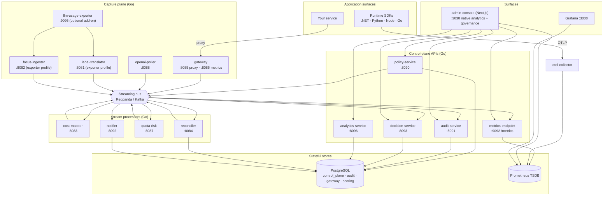

<!-- Copyright (c) 2026 Yasvanth Udayakumar. -->
<!-- SPDX-License-Identifier: Apache-2.0 -->

# Components & Container View (C2)

This document shows the runnable pieces of OpenLLM Metrics — the containers that
`docker compose up` starts — and what each one is responsible for. For the
conceptual model see [overview.md](./overview.md); for how data moves between
these containers see [data-flow.md](./data-flow.md).

## Table of Contents

- [Container diagram](#container-diagram)
- [Service catalog](#service-catalog)
- [Infrastructure dependencies](#infrastructure-dependencies)
- [Why event-driven](#why-event-driven)
- [See also](#see-also)

## Container diagram

## Service catalog

Every service is a small Go binary unless noted. Ports are host ports from the
local [docker-compose.yml](../../docker-compose.yml).

### Capture plane

| Service                | Port        | Responsibility                                                                                                                                                                                                                                              | Key topics                                 |
| ---------------------- | ----------- | ----------------------------------------------------------------------------------------------------------------------------------------------------------------------------------------------------------------------------------------------------------- | ------------------------------------------ |
| **gateway**            | 8085 / 8086 | Reverse proxy for `chat.completions`, `messages`, `generateContent`, Bedrock `Invoke*`, Azure deployments. Captures latency, status, retries, tokens at the request boundary. Forwards provider keys from the caller; never stores them; never logs bodies. | produces `llm.runtime.normalized`          |
| **openai-poller**      | 8088        | In-repo pull-mode billing poller for OpenAI's usage/admin API. The reference adapter for pull mode.                                                                                                                                                         | produces `llm.usage.normalized`            |
| **llm-usage-exporter** | 9095        | Optional, bring-your-own upstream exporter (Apache-2.0) for non-OpenAI pull-mode billing. Started only with `--profile exporter`.                                                                                                                           | exposes `/metrics`, `/focus.json`          |
| **label-translator**   | 8081        | Maps upstream exporter labels `{provider, tenant, tenancy_id}` → canonical `{tenant, team, app, env, project, …}` using a per-tenant mapping table. Exporter profile only.                                                                                  | emits normalized usage (`source=exporter`) |
| **focus-ingester**     | 8082        | Polls the exporter `/focus.json` FOCUS endpoint, persists records, emits vendor-reconciled billing events. Exporter profile only.                                                                                                                           | produces `llm.usage.reconciled`            |

### Stream processors (workers)

| Service         | Port | Responsibility                                                                                                                                                                         | Key topics                                                                                  |
| --------------- | ---- | -------------------------------------------------------------------------------------------------------------------------------------------------------------------------------------- | ------------------------------------------------------------------------------------------- |
| **cost-mapper** | 8083 | Prices runtime token counts against the per-provider catalog in [`platform/pricing/`](../../platform/pricing/) → estimated cost. Pure `tokens × rate`.                                 | consumes `llm.runtime.normalized`, `llm.usage.reconciled`; produces `llm.cost.estimated`    |
| **reconciler**  | 8084 | Correlates runtime estimate vs. vendor-reconciled cost per `(tenant, provider, model, window)`; computes drift; writes results + gauges. See [reconciliation.md](./reconciliation.md). | consumes `llm.cost.estimated`, `llm.usage.reconciled`; produces `llm.reconciliation.window` |
| **quota-risk**  | 8087 | Models provider rate-limit / quota burn from response headers into a transparent `used_ratio` + linear `risk_score`. Signal only, no enforcement.                                      | consumes `llm.usage.normalized`, `llm.runtime.normalized`; produces `llm.quota.risk.v1`     |
| **notifier**    | 8092 | Fans out alerts to webhook and SMTP sinks per tenant rules.                                                                                                                            | consumes `alert.event.v1`; produces `audit.event.v1` on rule mutations                      |

### Control-plane APIs

| Service               | Port | Responsibility                                                                                                                                                         | Key topics                                                |
| --------------------- | ---- | ---------------------------------------------------------------------------------------------------------------------------------------------------------------------- | --------------------------------------------------------- |
| **metrics-endpoint**  | 9092 | Aggregates bus signals into the canonical Prometheus `/metrics` surface (cumulative counters, no resets). The scrape target.                                           | consumes `llm.usage.normalized`, `llm.runtime.normalized` |
| **policy-service**    | 8090 | CRUD + validation + version history for declarative policy documents.                                                                                                  | produces `audit.event.v1`                                 |
| **audit-service**     | 8091 | Hash-chained append-only audit ledger with tamper-evidence; JSON export for SIEM. Verifiable via the `olm-audit` CLI.                                                  | consumes `audit.event.v1`                                 |
| **decision-service**  | 8093 | Stores and serves routing-decision records for the explainability ledger.                                                                                              | consumes `routing.decision.v1`                            |
| **analytics-service** | 8096 | Stores per-tenant saved analytics views (declarative `llm_*` selector specs) for the console's dashboards screen. CRUD only — never executes queries or scores series. | none (Postgres-backed HTTP CRUD)                          |

### Surfaces

| Service            | Port | Responsibility                                                                                                                                                                                                                                             |
| ------------------ | ---- | ---------------------------------------------------------------------------------------------------------------------------------------------------------------------------------------------------------------------------------------------------------- |
| **admin-console**  | 3030 | Next.js governance + observability console. First-party `/analytics/*` screens (cost, tokens, errors, reconciliation) read the metrics endpoint and Prometheus directly; governance screens read the control-plane APIs. No provider keys pass through it. |
| **demo-generator** | 8089 | `--profile demo` only. Emits synthetic, schema-conformant telemetry across all five providers so every screen lights up with zero real keys. Marked `source_service: examples/demo-generator`.                                                             |

## Infrastructure dependencies

| Component                | Port      | Role                                                                                                                                                      |
| ------------------------ | --------- | --------------------------------------------------------------------------------------------------------------------------------------------------------- |
| **PostgreSQL 16**        | 5433      | Policy, audit, scoring, routing, reconciliation, identity. Schemas: `control_plane`, `audit`, `gateway`, `scoring`. Row-level security; goose migrations. |
| **Redpanda** (Kafka API) | 19092     | The streaming bus. Idempotent, replay-safe consumers; per-topic DLQs.                                                                                     |
| **Prometheus**           | 9090      | TSDB scraping the metrics endpoint; alert rules.                                                                                                          |
| **OTel Collector**       | 4317/4318 | Receives OTLP from SDKs; exports to Prometheus.                                                                                                           |
| **Grafana**              | 3000      | Optional dashboards over Prometheus. (Native console analytics cover the same ground without Grafana.)                                                    |
| **Redpanda Console**     | 8095      | Bus inspection UI.                                                                                                                                        |

## Why event-driven

Producers and consumers are decoupled through the bus so that:

- **Capture never blocks on control plane.** The gateway publishes a runtime
  event and returns; pricing, reconciliation, scoring, and audit happen
  asynchronously downstream.
- **Replay is safe.** Consumers are idempotent (keyed on `event_id`), so a
  cost-catalog fix or a new consumer can replay history without double-counting.
- **New consumers are additive.** Adding the OTel receiver, a new dashboard
  feed, or an custom scoring worker means subscribing to an existing topic
  — no producer change.

## See also

- [data-flow.md](./data-flow.md) — the end-to-end pipeline across these
  containers, topic by topic.
- [sequences.md](./sequences.md) — request-level interactions.
- [deployment.md](./deployment.md) — how these containers are deployed and
  wired locally and on Kubernetes.
- [`platform/bus/topics.yaml`](../../platform/bus/topics.yaml) — the canonical
  topic catalog with producers and consumers.
