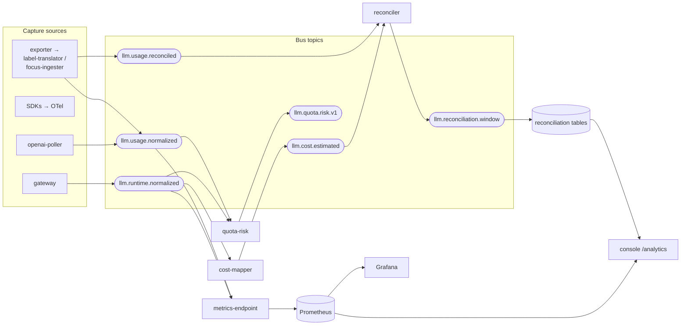

<!-- Copyright (c) 2026 Yasvanth Udayakumar. -->
<!-- SPDX-License-Identifier: Apache-2.0 -->

# Telemetry Data Flow

How a raw LLM signal becomes a normalized metric, a reconciled cost, and a
governance record. This is the pipeline view; for the boxes themselves see
[components.md](./components.md).

## Table of Contents

- [The five capture sources](#the-five-capture-sources)
- [End-to-end pipeline](#end-to-end-pipeline)
- [Topic catalog](#topic-catalog)
- [The canonical event](#the-canonical-event)
- [From event to metric](#from-event-to-metric)
- [Privacy & cardinality guards](#privacy--cardinality-guards)
- [See also](#see-also)

## The five capture sources

Each source catches operational signal the others miss; all collapse into one
canonical schema before crossing a service boundary.

| #   | Source                      | Captures                                                           | Mode                                                |
| --- | --------------------------- | ------------------------------------------------------------------ | --------------------------------------------------- |
| 1   | **Gateway**                 | Live latency, status, retries, tokens at the request boundary      | Runtime (default)                                   |
| 2   | **Runtime SDKs**            | In-process `gen_ai.*` spans + `llm_*` metrics with tenancy baggage | Runtime (default)                                   |
| 3   | **Pull-mode pollers**       | Authoritative usage/cost from provider billing APIs                | Pull (OpenAI in-repo; others via optional exporter) |
| 4   | **OTel Collector receiver** | Pull from existing OTel pipelines                                  | Runtime                                             |
| 5   | **Reconciliation**          | The join of runtime estimate against billed cost                   | Derived                                             |

## End-to-end pipeline



**The two cost planes meet at the reconciler.** The runtime plane
(`gateway → cost-mapper → llm.cost.estimated`) is fast and rich in
`{team, app, env, project}` context but only as accurate as the pricing
catalog. The billing plane (`exporter → focus-ingester → llm.usage.reconciled`)
is authoritative on dollars but lags and lacks app context. The reconciler
joins them per `(tenant, provider, model, window)` and emits the drift signal.

## Topic catalog

Canonical source of truth: [`platform/bus/topics.yaml`](../../platform/bus/topics.yaml).
Every topic has a JSON Schema under [`packages/contracts/`](../../packages/contracts/)
and an auto-named `<topic>.dlq` dead-letter topic.

| Topic                       | Producer(s)                     | Consumer(s)                               | Retention |
| --------------------------- | ------------------------------- | ----------------------------------------- | --------- |
| `llm.runtime.normalized`    | gateway (SDK path via OTel)     | metrics-endpoint, cost-mapper, quota-risk | 7 d       |
| `llm.usage.normalized`      | openai-poller, label-translator | metrics-endpoint, quota-risk              | 7 d       |
| `llm.usage.reconciled`      | focus-ingester                  | reconciler, cost-mapper                   | 30 d      |
| `llm.cost.estimated`        | cost-mapper                     | reconciler                                | 7 d       |
| `llm.reconciliation.window` | reconciler                      | dashboards (via Postgres)                 | 30 d      |
| `llm.quota.risk.v1`         | quota-risk                      | dashboards / custom routing           | 3 d       |
| `audit.event.v1`            | policy-service, notifier        | audit-service                             | 1 y       |
| `alert.event.v1`            | alert bridge / evaluators       | notifier                                  | 7 d       |
| `routing.decision.v1`       | registered routing decider      | decision-service                          | 90 d      |

> **Boundary note.** Topic _names_ and event _field names_ that carry decision
> outputs (`decision`, `risk_score`, `selected_provider`) are OSS-public. The
> algorithms that produced those values are outside the scope of schemas, topics, and event contracts.

## The canonical event

Every source normalizes to a content-free event keyed for idempotent replay.
The runtime event shape (abbreviated; full schema in
[`llm.runtime.normalized.v1.json`](../../packages/contracts/telemetry/go/schemas/llm.runtime.normalized.v1.json)):

```jsonc
{
  "schema_version": "v1",
  "event_id": "uuid", // idempotency key
  "source_mode": "proxy", // gateway | sdk | exporter | otel
  "provider": "openai",
  "model": "gpt-4o-mini",
  "operation": "chat",
  "tenant": "acme",
  "team": "platform-eng",
  "app": "chat-assistant",
  "env": "prod",
  "project": "acme-chat",
  "status": "success",
  "status_code": 200,
  "error_type": "",
  "latency_us": 412000,
  "retry_count": 0,
  "is_streaming": true,
  "input_tokens": 42,
  "output_tokens": 128,
  "total_tokens": 170,
  "request_id_hash": "sha256(...)", // only the hash, never the raw id
  "trace_id": "...",
  "recorded_at": "2026-06-18T...",
}
```

There is **no** prompt, completion, message, or content field anywhere in the
schema — the privacy invariant is enforced by the type system, not by
configuration.

## From event to metric

The metrics-endpoint folds bus events into the canonical `llm_*` Prometheus
series. The metric registry
([`packages/contracts/metrics/go/registry.go`](../../packages/contracts/metrics/go/registry.go))
is the single authority; schema-lint rejects unknown names or unauthorized
labels at CI time.

| Metric                                                                          | Type    | From                              |
| ------------------------------------------------------------------------------- | ------- | --------------------------------- |
| `llm_requests_total`                                                            | counter | every runtime/usage event         |
| `llm_input_tokens_total` / `llm_output_tokens_total` / `llm_total_tokens_total` | counter | token fields                      |
| `llm_cost_usd_total`                                                            | counter | cost-mapper / poller              |
| `llm_errors_total`                                                              | counter | normalized `error_type`           |
| `llm_retries_total` / `llm_timeouts_total` / `llm_rate_limit_events_total`      | counter | runtime status                    |
| `llm_provider_api_errors_total`                                                 | counter | poller/aggregator pipeline errors |

Mandatory labels on every core metric: `provider`, `model`, `tenant`, `env`.
The full optional set adds `team`, `app`, `project`, `operation`,
`status_code`, `error_type`, `region`. Project metrics use the `llm_` prefix;
duration/token histograms also map to OTel `gen_ai.*` — see
[otel-genai-mapping.md](./otel-genai-mapping.md).

## Privacy & cardinality guards

- **Forbidden fields.** `prompt`, `completion`, `input`, `output`, `messages`,
  `embedding`, `content`, `request_body`, `response_body` are rejected by
  schema-lint anywhere in a payload, label, or attribute.
- **Request IDs are hashed.** Only `sha256(request_id)` ever leaves a process.
- **Cardinality budgets.** Each metric declares a per-tenant/24h series budget
  in the registry; crossing it warns in CI and alerts SRE in production. See
  [`platform/tsdb/CARDINALITY_BUDGET.md`](../../platform/tsdb/CARDINALITY_BUDGET.md).

## See also

- [schemas.md](./schemas.md) — versioning rules for every contract surface.
- [reconciliation.md](./reconciliation.md) — the drift math and lifecycle.
- [sequences.md](./sequences.md) — the same flows as step-by-step sequences.
- [otel-genai-mapping.md](./otel-genai-mapping.md) — `llm_*` ↔ `gen_ai.*`.
