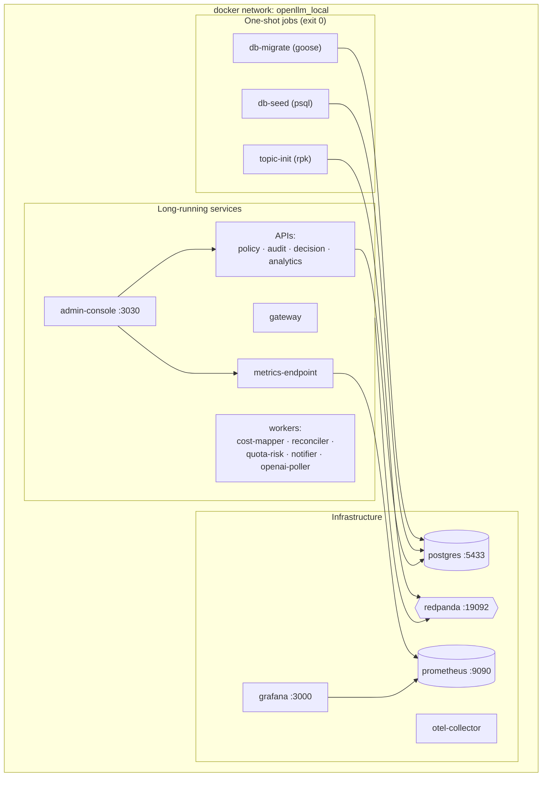

<!-- Copyright (c) 2026 Yasvanth Udayakumar. -->
<!-- SPDX-License-Identifier: Apache-2.0 -->

# Deployment Topology

How OpenLLM Metrics is packaged and run — locally with Docker Compose and on
Kubernetes with the Helm chart. For what each container does, see
[components.md](./components.md); for getting started, see
[the quickstart](../quickstart.md).

## Table of Contents

- [Compose profiles](#compose-profiles)
- [Local topology](#local-topology)
- [Host port map](#host-port-map)
- [Port conflicts (local override)](#port-conflicts-local-override)
- [Database & migrations](#database--migrations)
- [Kubernetes (Helm)](#kubernetes-helm)
- [Production expectations](#production-expectations)
- [See also](#see-also)

## Compose profiles

The single [docker-compose.yml](../../docker-compose.yml) is layered with
profiles so you run only what you need.

| Command                                   | What starts                                                               | Use when                         |
| ----------------------------------------- | ------------------------------------------------------------------------- | -------------------------------- |
| `docker compose up -d`                    | Full core stack: infra + gateway + workers + control-plane APIs + console | Default runtime-first stack      |
| `docker compose --profile demo up -d`     | Core stack **+ demo-generator** (synthetic traffic, no real keys)         | First run / evaluation           |
| `docker compose --profile exporter up -d` | Core stack **+ llm-usage-exporter + label-translator + focus-ingester**   | Pull-mode billing reconciliation |

Telemetry is **runtime-first**: the gateway and SDKs need no exporter. The
exporter profile is a bring-your-own add-on — set `LLM_USAGE_EXPORTER_IMAGE`
to your own exporter image.

## Local topology



Startup ordering is enforced by Compose health/`depends_on`: Postgres and
Redpanda become healthy, `db-migrate` then `db-seed` then `topic-init` run to
completion, and only then do the data-backed services start.

## Host port map

| Surface           | Port      | Surface            | Port  |
| ----------------- | --------- | ------------------ | ----- |
| admin-console     | 3030      | gateway (proxy)    | 8085  |
| Grafana           | 3000      | gateway (metrics)  | 8086  |
| Prometheus        | 9090      | openai-poller      | 8088  |
| metrics-endpoint  | 9092      | quota-risk         | 8087  |
| policy-service    | 8090      | label-translator   | 8081  |
| audit-service     | 8091      | focus-ingester     | 8082  |
| notifier          | 8092      | cost-mapper        | 8083  |
| decision-service  | 8093      | reconciler         | 8084  |
| analytics-service | 8096      | demo-generator     | 8089  |
| Redpanda Console  | 8095      | Redpanda (Kafka)   | 19092 |
| PostgreSQL        | 5433      | llm-usage-exporter | 9095  |
| OTel Collector    | 4317/4318 |                    |       |

## Port conflicts (local override)

Compose merges an optional, **gitignored** `docker-compose.override.yml` for
host-specific remaps. When a host port is taken by another stack, override just
that service's ports with `!override`:

```yaml
# docker-compose.override.yml (local only; not committed)
services:
  grafana:
    ports: !override
      - '3005:3000'
```

The committed compose remains the canonical port map; overrides are local.

## Database & migrations

- **Migrations** are goose, applied by the one-shot `db-migrate` over each
  per-schema tree under [`platform/db/<schema>/migrations`](../../platform/db/).
  Idempotent — re-running `up` is a no-op. (Conventions:
  [`platform/db/CONVENTIONS.md`](../../platform/db/CONVENTIONS.md).)
- **Seeds** are applied by the one-shot `db-seed` over
  [`platform/db/seeds/*.sql`](../../platform/db/seeds/) — identity/tenant demo
  data plus a governance demo, all idempotent (`ON CONFLICT`).
- **Schemas**: `control_plane`, `audit`, `gateway`, `scoring`. Application
  connections run under default-deny row-level security.

## Kubernetes (Helm)

The chart lives at
[`platform/deployment/helm/openllm-metrics`](../../platform/deployment/helm/openllm-metrics).

> **Status (honest).** The chart currently templates **metrics-endpoint** and
> **openai-poller** (plus ServiceMonitor wiring for Prometheus Operator). The
> remaining services are deployable today via Docker Compose; broadening the
> Helm chart to the full service set is tracked roadmap work, not a shipped
> guarantee. Treat Compose as the reference deployment until the chart reaches
> parity.

## Production expectations

The OSS distribution targets self-hosted, single-team to platform-team
deployments. Hardening that is **deliberately bring-your-own** (documented, not
shipped):

- **Gateway auth** — the gateway forwards caller-supplied provider keys and
  does not authenticate callers itself; run it on a trusted network or front it
  with your own auth proxy.
- **Secrets** — provider keys are passed as env/secret material per environment;
  use a real secret store in production. Keys are never logged, traced, or
  stored by the platform.
- **HA / scaling** — Redpanda replication, Postgres HA, and multi-replica
  workers are operator-configured.

These boundaries are intentional for an OSS-first launch; the managed custom
distribution layers SSO, HSM-backed key vaults, and HA on top.

## See also

- [the quickstart](../quickstart.md) — step-by-step local launch.
- [components.md](./components.md) — per-service responsibilities.
- [bundled-vs-external.md](./bundled-vs-external.md) — the bundled exporter.
- [`platform/deployment/`](../../platform/deployment/) — compose configs and
  the Helm chart.
