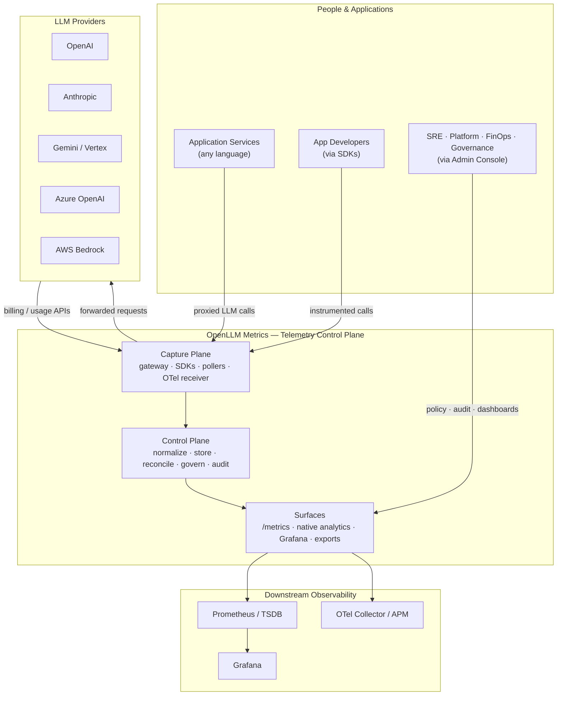
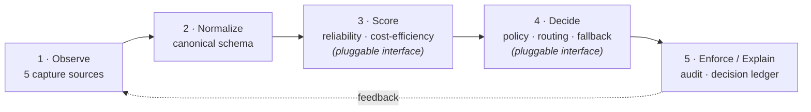

<!-- Copyright (c) 2026 Yasvanth Udayakumar. -->
<!-- SPDX-License-Identifier: Apache-2.0 -->

# Architecture Overview — Conceptual Model & System Context

This is the entry point for understanding how OpenLLM Metrics is built. It
explains the **concepts** the platform is organized around and shows the
**system context** — who talks to it and what it depends on. For the
component-level breakdown, the telemetry pipeline, request sequences, and
deployment topology, follow the links in [See also](#see-also).

## Table of Contents

- [What the platform is](#what-the-platform-is)
- [Core concepts](#core-concepts)
- [Design invariants](#design-invariants)
- [System context (C1)](#system-context-c1)
- [The control loop, conceptually](#the-control-loop-conceptually)
- [See also](#see-also)

## What the platform is

OpenLLM Metrics is an **OpenTelemetry-native telemetry control plane for
multi-provider LLM API operations**. It collects every operational signal that
matters when LLM APIs are production dependencies — latency, token usage,
retries, errors, throttling, quota burn, and reconciled provider cost — across
OpenAI, Anthropic, Google Gemini / Vertex AI, Azure OpenAI, and AWS Bedrock,
then **normalizes** those provider-specific signals into one canonical schema
so dashboards, scoring, policy, audit, and exports all read the same shape.

It is **runtime-first**: the in-repo Go gateway and language SDKs capture
provider usage, cost, and latency directly, with **no external exporter**
required. A pull-mode billing path (the in-repo OpenAI poller, plus the
optional `llm-usage-exporter` add-on for other providers) supplies
authoritative billed cost for reconciliation when you want it.

## Core concepts

| Concept                 | Definition                                                                                                                                                                                                           |
| ----------------------- | -------------------------------------------------------------------------------------------------------------------------------------------------------------------------------------------------------------------- |
| **Capture source**      | One of five surfaces that observe LLM traffic: proxy gateway, runtime SDKs, pull-mode billing pollers, OTel Collector receiver, and runtime↔pull reconciliation. Each catches signal the others miss.                |
| **Canonical event**     | The provider-neutral, content-free event every source collapses into before crossing a service boundary. JSON Schema 2020-12 contracts live in [`packages/contracts/`](../../packages/contracts/).                   |
| **Streaming bus**       | The Kafka/Redpanda backbone all events flow through. Consumers are idempotent and replay-safe.                                                                                                                       |
| **Control plane**       | The stateful services that store, score, govern, and explain: policy, audit, decision, and the admin console.                                                                                                        |
| **Tenancy context**     | The `tenant / team / app / env / project` label set carried on **every** metric, event, and audit row. Multi-tenant from day one — there is no "default tenant" path.                                                |
| **Extension interface** | A public Go interface (scoring, routing, policy, fallback) with safe no-op defaults and optional custom providers registered at boot. See [extension-boundary.md](./extension-boundary.md). |

## Design invariants

These hold everywhere in the codebase; treat them as non-negotiable when
extending the system.

1. **Privacy-first.** Prompts and completions are never collected, stored,
   logged, traced, or telemetered. Only counts, timings, labels, status codes,
   and costs flow. The schema-lint package rejects payload keys
   (`prompt`, `completion`, `messages`, …) at CI time.
2. **Multi-tenant by construction.** Every signal carries
   `tenant / team / app / env / project`. Tenant is a mandatory metric label.
3. **Schema/interface stability is a public API.** Every cross-service contract
   is versioned with explicit safe-vs-breaking rules (see
   [schemas.md](./schemas.md)).
4. **Adapters, not forks.** New providers, SDK languages, and exporters are
   adapters under stable interfaces.
5. **OTel-native.** Project metrics use the `llm_*` prefix and **extend** the
   OpenTelemetry GenAI semantic conventions (`gen_ai.*`) rather than replacing
   them (see [otel-genai-mapping.md](./otel-genai-mapping.md)).
6. **Decisioning scope.** This repo documents the events these modules emit and the gauges they write. Production scoring, routing, policy-evaluation, and fallback algorithms are intentionally not implemented here.

## System context (C1)

The highest-level view: the actors and external systems around the platform.

**Reading the diagram.** Applications either route LLM calls _through_ the
gateway (proxy mode) or emit spans/metrics in-process (SDK mode). The platform
forwards proxied calls to the real providers and, separately, pulls billing
data back from provider APIs. Everything normalizes in the control plane and
surfaces as a Prometheus `/metrics` endpoint, first-party analytics in the
console, optional Grafana dashboards, and optional exports.

## The control loop, conceptually

OpenLLM Metrics is a loop, not a dashboard. Stages 1, 2, and 5 are concrete services in this repo. Stages 3 and 4 are pluggable interfaces with safe defaults.

The open-source distribution delivers stages 1, 2, and 5 in full, plus the **risk and cost signals** that feed stages 3-4 (quota risk, cost mapping, reconciliation drift). Stages 3-4 ship as stable interfaces with safe no-op defaults so the loop runs end-to-end out of the box.

## See also

- [components.md](./components.md) — the container/component view and the
  service catalog (what each binary does).
- [data-flow.md](./data-flow.md) — the telemetry pipeline: topics, producers,
  consumers, and how a signal becomes a metric.
- [sequences.md](./sequences.md) — request-level sequence diagrams.
- [deployment.md](./deployment.md) — local and Kubernetes deployment topology.
- [extension-boundary.md](./extension-boundary.md) — how to implement a custom
  scoring/routing/policy provider against the public interfaces.
- [schemas.md](./schemas.md) · [reconciliation.md](./reconciliation.md) ·
  [otel-genai-mapping.md](./otel-genai-mapping.md) — deep dives.
