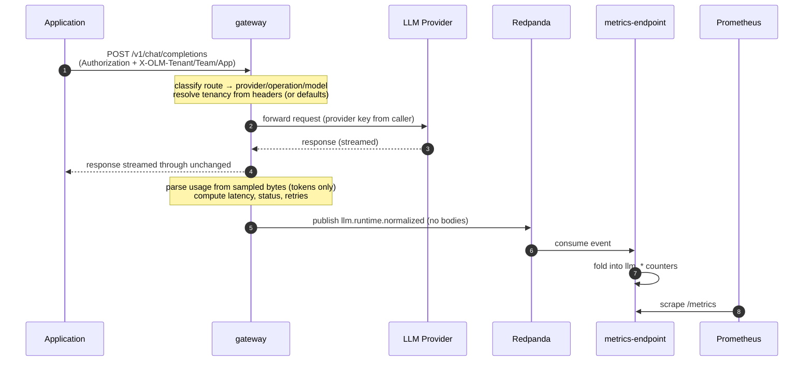
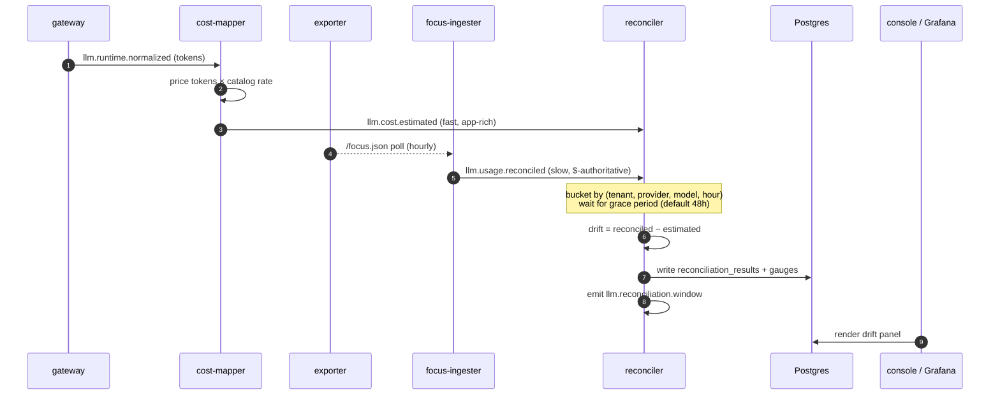
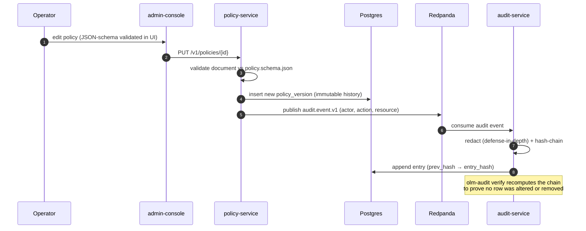
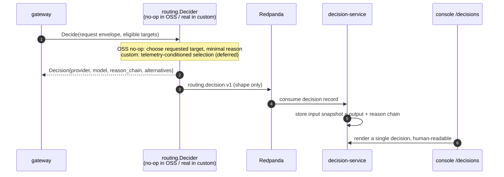

<!-- Copyright (c) 2026 Yasvanth Udayakumar. -->
<!-- SPDX-License-Identifier: Apache-2.0 -->

# Key Sequences

Step-by-step interactions for the flows that matter most. These complement the
pipeline view in [data-flow.md](./data-flow.md) by showing ordering, timing, and
who calls whom.

## Table of Contents

- [1. Proxy-mode request capture](#1-proxy-mode-request-capture)
- [2. Reconciliation: runtime estimate vs billed cost](#2-reconciliation-runtime-estimate-vs-billed-cost)
- [3. Policy mutation with audit](#3-policy-mutation-with-audit)
- [4. Routing decision (interface + ledger)](#4-routing-decision-interface--ledger)
- [See also](#see-also)

## 1. Proxy-mode request capture

The defining "no code change" path: an app points its provider base URL at the
gateway. The gateway forwards the call unchanged and captures telemetry from
the boundary — **after** the response has been streamed to the client, so
capture never adds latency to the user's call and never touches body content
beyond extracting integer token counts.

Key properties: provider keys are forwarded from the caller and never stored;
the response reaches the client before any parsing; only token integers and
labels are published. See the parser contracts in
[`apps/gateway/internal/usage/`](../../apps/gateway/internal/usage/).

## 2. Reconciliation: runtime estimate vs billed cost

Two independent planes converge. The runtime plane prices tokens immediately;
the billing plane arrives hours later with authoritative dollars. The reconciler
buckets both by `(tenant, provider, model, window)` and emits the drift once the
grace period elapses.

The math is intentionally trivial (a subtraction and a ratio) — see
[reconciliation.md](./reconciliation.md). Acting on the drift (alerting,
routing, budget enforcement) is downstream and, for routing/scoring, custom.

## 3. Policy mutation with audit

Every governance mutation produces a tamper-evident audit record. The
policy-service writes the policy and publishes an audit event; the audit-service
hash-chains it into the append-only ledger.

The OSS distribution stores and versions policies and proves the audit chain;
**evaluating** a policy against live traffic is the custom `policy.Evaluator`
provider (interface in OSS, implementation deferred).

## 4. Routing decision (interface + ledger)

OSS ships the decision _ledger_ and a no-op decider; custom ships the real
decider. Both write the same record shape, so the explainability surface is
identical regardless of which provider is registered.

The `routing.decision.v1` schema is a **render contract** — it defines the
fields the console displays, not the selection logic. The reason-chain and
alternatives are opaque JSON owned by whichever decider is registered.

## See also

- [overview.md](./overview.md) — the control loop these sequences implement.
- [data-flow.md](./data-flow.md) — the same flows as a topic pipeline.
- [extension-boundary.md](./extension-boundary.md) — implementing your own
  decider/scorer/evaluator.
- [reconciliation.md](./reconciliation.md) — the drift lifecycle in depth.
